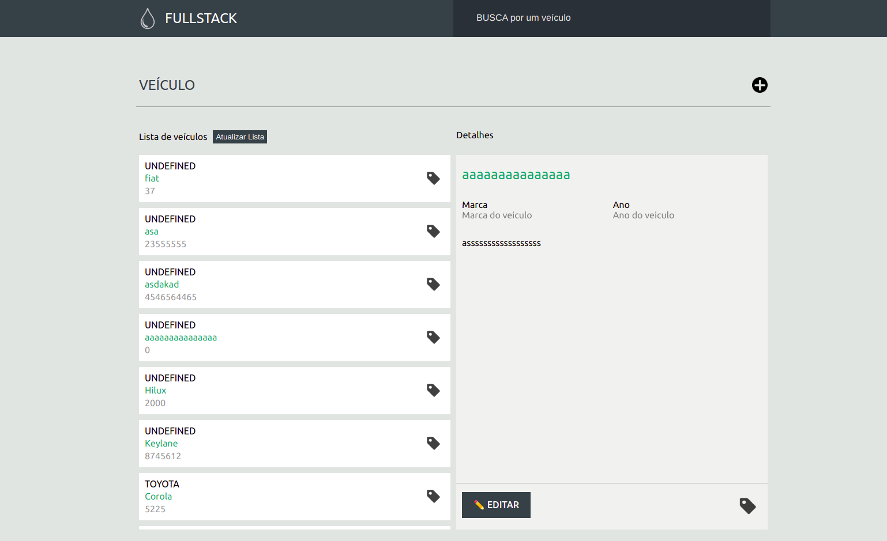
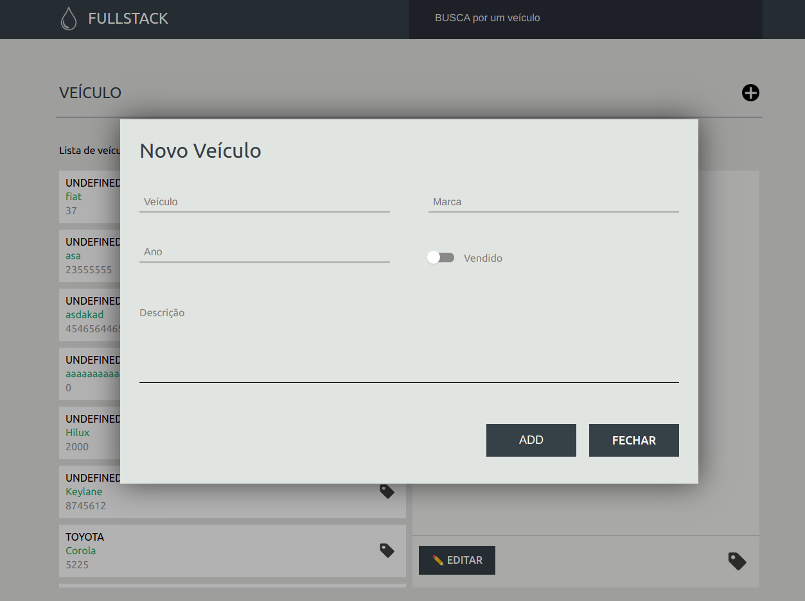

### Como rodar a aplicação na sua maquina?
- Certifique-se de que seu banco de dados mongo esteja rodando
  - No ubuntu é só rodar esse comando **sudo systemctl start mongod**
- Entre na pasta frontend dentro de App e rode o comando **yarn install**
  - Esse comando vai instalar as dependências da aplicação **react**
- Entre na pasta backend dentro de App e rode o comando **npm instal**
  - Esse comando vai instalar as dependências da aplicação **node**
 
* Depois que o **db estiver online** e as **dependências instalas**, ainda na pasta backend rode o comando **npm run dev**

#
<h2 align="center"> Tecnologias usadas </h2>

   
   
   
   
    
 

 
 #
 
  
  
 

